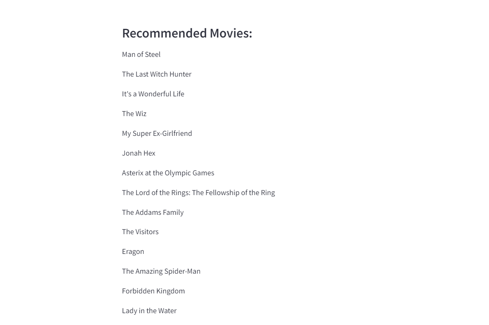

# Book and Movie Recommender System

## Overview

This project is a Book and Movie Recommender System that suggests books and movies based on user-defined genres. It utilizes Python, Pandas, and Streamlit to provide an interactive web application where users can input their preferred genres and receive personalized recommendations.

## Outputs




## Features

- **Genre-Based Recommendations**: Users can enter one or multiple genres to receive tailored suggestions for both books and movies.
- **Interactive Web Interface**: Built with Streamlit, allowing for a user-friendly experience.
- **Data Processing**: Extracts and processes genre-related keywords from CSV files containing book and movie data.

## Technologies Used

- Python
- Pandas
- Streamlit
- CSV (for data storage)

## Installation

1. Clone the repository:
   ```bash
   git clone https://github.com/javyriaa1/Book-Movie-recommender.git
   ```
   
2. Navigate to the project directory:
   ```bash
   cd Book-Movie-recommender
   ```

3. Set up a virtual environment (optional but recommended):
   ```bash
   python -m venv venv
   source venv/bin/activate  # On Windows use `venv\Scripts\activate`
   ```

4. Install the required packages:
   ```bash
   pip install -r requirements.txt
   ```

## Usage

1. Start the Streamlit application:
   ```bash
   streamlit run app.py
   ```

2. Open your web browser and go to `http://localhost:8501` to access the application.

3. Enter your desired genres in the input field and click "Submit" to receive recommendations.

## Data Files

- `books.csv`: Contains a collection of books with their titles and associated genres.
- `movies.csv`: Contains a collection of movies with their titles and associated genres.
